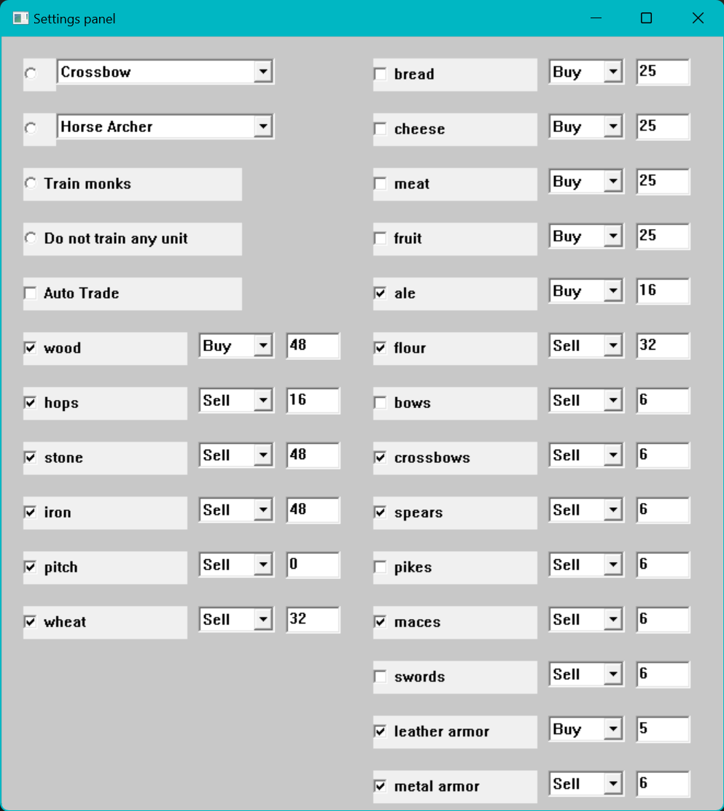

Stronghold Crusader Auto Market and Auto Unit Trainer
-----------------------------------------------------

FAQ:
- This is not a cheat tool! Don't ask.
- Only works in single player games. Doesn't work on multiplayer.
- Use it on your own risk. Save your game/progress before attempting to run this tool.

How to:
- Make sure you compile for 32-bit (x86) setting in Visual Studio
- Place dll near injector.exe and run exe as administrator
- Setup your preferences in preferences.cpp
  
Roadmap:
- Check if market exists before auto train. Currently without market, trading is possible.
- Check if barracks/mercenary exists before able to train units
- Implement training monks.
  - Possible Addresses for function entry point:
    - 00527FCE
    - 9643AC
- Add settings file read/write.

Works only Strongold Crusader version 1.1

Execuatable signature
---------------------
Name: Stronghold Crusader.exe
Size: 2727936 bytes (2664 KiB)
CRC32: D576C54B
CRC64: 35F3E79939D98A54
SHA256: 9a675be85b7c012f21188b19fdf73359aa36729a79b91b42e819485d0cda9988
SHA1: cb9abdfb64fa172320c6c86625a48bb592890803
BLAKE2sp: 0fc17bdeb711920de20a477c8ec8faac7579a0e3f86c6b8d7177676c94d680d0
